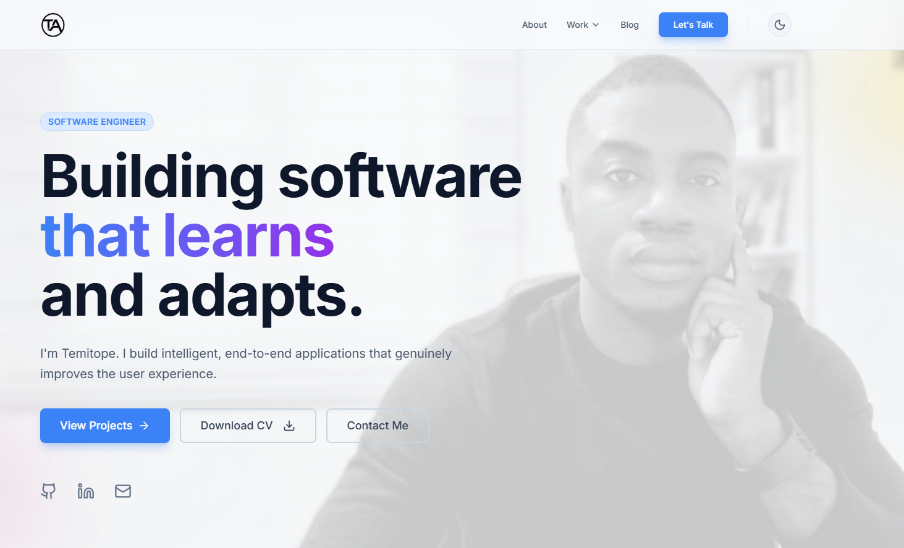

# Temitope Agbola - Senior Full-Stack Engineer Portfolio

A high-performance, accessible, and SEO-optimized developer portfolio built with modern web technologies. This project showcases my work in Distributed Systems, AI/MLOps, and Cloud Engineering through detailed case studies and technical writing.



## 🚀 Tech Stack

- **Core:** [React 18](https://react.dev/), [TypeScript](https://www.typescriptlang.org/), [Vite](https://vitejs.dev/)
- **Styling:** [Tailwind CSS](https://tailwindcss.com/)
- **Animations:** [Framer Motion](https://www.framer.com/motion/)
- **Icons:** [Lucide React](https://lucide.dev/)
- **Content:** React Markdown (with custom code block rendering)
- **Forms & Scheduler:** Web3Forms API, Calendly Integration
- **SEO:** Automated Sitemap Generation, Semantic HTML5

## ✨ Key Features

* **🎨 Dynamic Theme System:** Seamless Light/Dark mode toggling with persistence.
* **📂 Deep-Dive Case Studies:** A dedicated section for architectural breakdowns (e.g., Treny Logistics, Vitalos Health), featuring expanding summaries and detailed technical diagrams.
* **📝 Technical Blog:** Markdown-based blog system with:
    * Syntax highlighting for code blocks.
    * Search/Filter functionality by title and tags.
    * Estimated read time and SEO-friendly slugs.
* **📞 Hybrid Contact Page:**
    * **Message Form:** Powered by Web3Forms for direct emails.
    * **Scheduler:** Integrated Calendly widget for booking discovery calls directly (syncs with Google/Apple/Outlook).
* **🔍 SEO & Performance:**
    * `postbuild` script automatically generates `sitemap.xml` for Google Indexing.
    * Lazy loading and page transitions for optimal Core Web Vitals.

## 🛠️ Getting Started

### Prerequisites

* Node.js (v18 or higher)
* npm or yarn

### Installation

1.  **Clone the repository:**
    ```bash
    git clone [https://github.com/isaacpyo/temitope-portfolio.git](https://github.com/isaacpyo/temitope-portfolio.git)
    cd temitope-portfolio
    ```

2.  **Install dependencies:**
    ```bash
    npm install
    ```

3.  **Run the development server:**
    ```bash
    npm run dev
    ```
    Open [http://localhost:5173](http://localhost:5173) to view it in the browser.

## ⚙️ Configuration

### Contact Form (Web3Forms)
To make the contact form functional:
1.  Get a free Access Key from [Web3Forms](https://web3forms.com/).
2.  Open `src/pages/Contact.tsx`.
3.  Replace the placeholder key:
    ```typescript
    access_key: "YOUR_ACCESS_KEY_HERE",
    ```
    *(Note: For production, it is recommended to move this to a `.env` file).*

### Calendly Integration
To enable the meeting scheduler:
1.  Open `src/pages/Contact.tsx`.
2.  Uncomment the `iframe` block in the **Schedule** tab.
3.  Replace the `src` URL with your personal Calendly link.

## 📦 Building for Production

To create a production build:

```bash
npm run build